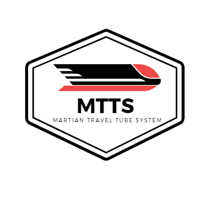

# Martian Travel Tube System

## What are we ?

### Project Concept:

We provide a fast, safe, reliable, fun and fully automatic travel system for dome inhabitants and companies. 
By offering the fastest way of transportation, it grants people less travel time, which translates to more sleep, freetime and worry free lives. 
For companies we offer a separate tubular network with larger pods to guarantee fast deliveries on large shipments. 

### Mission:
Our goal is to realise the fastest lead times possible:

By lead time we are referring to the speed at which goods can be delivered to their destination after placing an order. 
The speed at which a good is ordered and the delivery of it is, through our innovative system, unprecedented.

We are also referring to the efficiency of transporting humans to their desired / required location. 
Decreasing travel time enriches human lives. Response time to emergency situations is drastically lowered. 
This allows our own emergency task force to respond quickly to infrastructural emergencies. 
All other emergency services also benefit from this, increasing safety by a large margin.

### Vision:
Through an easily accessible network of travel tubes we want to 
allow goods and people to travel more efficiently than ever.

## How do we do it ?

By creating a user-friendly mobile focused **client** application that communicates through a REST API and sockets with
our Java **server**. 

The client allows users to easily order pods for personal or package transportation.
 
### Implemented technical requirements
The following are our implemented technical requirements.

#### Self-study topics

* Push notifications
* CSS animations
* SASS framework
* Leaflet.js framework

#### Class-taught topics

* Real-time communication
* A mobile client written in HTML/CSS/JavaScript
* Server written in Java using the VertX library
* Server side unit testing
* H2 database to collect user data
* REST API according to OpenAPI standards

### POC features:

* **Order pods for Martian transport**
* **Order pods for package transport**
* **Visually display pod route**
* **A fully animated UI**
* **An interactive map with all available endpoints**
* **Notifications**
* **Location sharing to friends**
* **Friend list**
* **Estimated travel time**
* **Store user, travel and financial data in DB**
* **Switch between favorites and travel history list**

### Pride through greatness

* **Leaflet.js**  
We integrated the **leaflet.js** framework to implement a fully functional interactive map.  
Using this map, we simulate endpoint selection and visualise travel.
   
* **Application design**  
Our client has a sleek and clean design, pampering our users' eyes with its black & red core visual design.

* **Fully working back-end**  
Fully operational server side functionality.

* **Detailed and extensive business case**  
We put a lot of time and research into our business case.  
We hope readers will enjoy reading this document, as we put our hearts and souls into it.   
  
* **Full server wide testing**  
We ended up testing our server extensively.
Database, requests and exceptions are tested thoroughly.

### Bonus points

* **User testing**  
We did some extensive user testing, we included a detailed report in the appendix section of our business case.

* **Self study topics**  
We implemented one level 1 and two level 2 self-study topics. 

## Server

### Minimum requirements:

* **Java version 11 or higher**
* **Gradle**

IntelliJ has gradle integration. 

 
### Quick setup:
* [Go to our server repository](https://git.ti.howest.be/TI/2020-2021/s3/project-ii/projects/groep-15/server)
* Clone the repository
* Run the server

Clone the repo through Gitlab: 


Or clone the repo using the commandline:
```shell
git clone https://git.ti.howest.be/TI/2020-2021/s3/project-ii/projects/groep-15/server.git
```
* Run the server through the GUI:


Or use the terminal:

Navigate to the root of the project and execute

Windows: 
```shell
gradlew.bat run
```
Linux:
```shell
gradlew run
```

The server automatically creates the H2 Database, so no further configuration is needed.
The server should now be running and available for the client.

### Please refer to the server [readme](https://git.ti.howest.be/TI/2020-2021/s3/project-ii/projects/groep-15/server) file for more information. 

## Client

### Minimum requirements

* **Chrome or FireFox (or any other modern browser)**
* **[Sass](https://sass-lang.com/)**

### Quick setup

* Go to our [Client repo](https://git.ti.howest.be/TI/2020-2021/s3/project-ii/projects/groep-15/client)
* Clone our repo
* Install dependancies
* Install Sass

Clone the through gitlab:


Or clone the repo using the commandline:
```bash
git clone https://git.ti.howest.be/TI/2020-2021/s3/project-ii/projects/groep-15/client.git
```
Install dependencies:
```bash
npm install
```
Install sass:
```bash
npm install -g sass
```
Standard user account:
```
Login: test
Password: test
```

### Please refer to the client [readme](https://git.ti.howest.be/TI/2020-2021/s3/project-ii/projects/groep-15/client) for more information.

---

Written by Daniel Vlaeminck and Maarten Vercruysse